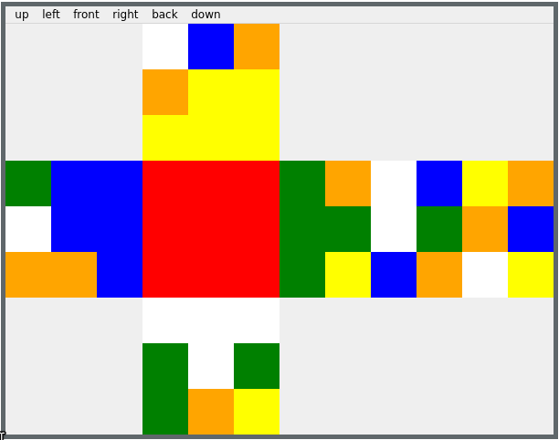

# Rainbow Cube

Small Rubik's Cube application, with goal to practice Qt framework and CMake. Rainbow Cube can be used to turn Rubik's Cube faces.

## Installation

Requirements:
- CMake 3.20 or later
- Qt 6

Run application with CMake or Qt Creator.

## Usage

Application shows Rubik's Cube faces. Faces have following orientation:
```
     up
left front right back
     down
```

Application menu contains six buttons, one for each face. They can be used to rotate faces clockwise.


## Structure

Application uses Qt widgets which are located in `src/app`.

Rubik's cube is located in `src/cube`. `Cube` object has to be created with `CubeBuilder` to connect face rotations to each other.

Directory `tests/cube` contains tests for cube. For example it generates [Superflip](https://en.wikipedia.org/wiki/Superflip) with cube moves and checks if cube state is correct.

## Cube Representation

Cube object consist six face objects, each with nine colors. Center color of face is stored separately. Rest of eight colors are stored in one dimensional array in clockwise order:
```
clockwise rotation:
0 1 2      6 7 0
7   3  =>  5   1
6 5 4      4 3 2
```
This solution makes rotation of faces easy, shifting indices by two.
